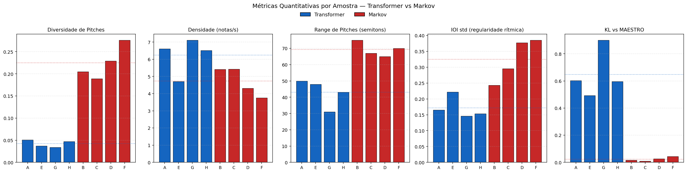
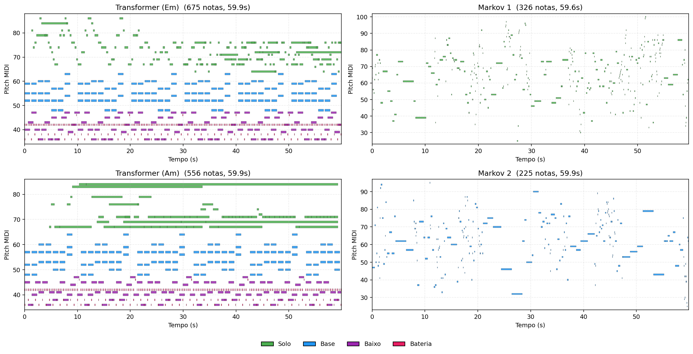

# Geração de Música por Meio de Inteligência Artificial Generativa

**Lucas Vinícius de Carvalho Ikeda¹, Orientador: Prof. Dr. Danillo Roberto Pereira²**

¹Faculdade de Ciências e Tecnologia – Universidade Estadual Paulista (UNESP)

lucas.ikeda@unesp.br, danillo.pereira@unesp.br

---

## Abstract

The recent advancement of generative neural networks, particularly Transformer architectures, has opened new possibilities for symbolic music generation. However, generating coherent multi-instrumental compositions that humans can identify as music — rather than random sequences of notes — remains an open challenge. In this work, we propose a hybrid pipeline that combines a decoder-only Transformer trained on piano-solo and multi-track MIDI datasets with algorithmic post-processing inspired by music theory. The model uses a vocabulary based on REMI tokenization with Bar-Relative Encoding to capture metric structure. The generation phase applies vocabulary constraints, register-based voice splitting, and a synthetic backbone (root-fifth walking bass, chord inversions, drum patterns) producing a band-like arrangement from a model originally trained on piano-solo data. Quantitative metrics show that the Transformer produces more rhythmically regular output than a Markov baseline (IOI std 0.17 vs 0.32) while maintaining structured progressions. The proposed pipeline meets the project's primary criterion: a human listener identifies the generated `.mid` as music rather than noise. Subjective evaluation (MOS) is ongoing.

**Keywords:** symbolic music generation; Transformer; deep learning; MIDI; REMI tokenization; deep learning.

## Resumo

O recente avanço das redes neurais generativas, especialmente as arquiteturas Transformer, abriu novas possibilidades para geração simbólica de música. Entretanto, gerar composições multi-instrumentais coerentes que um humano identifique como música — e não como sequências aleatórias de notas — continua sendo um desafio em aberto. Neste trabalho, propomos um pipeline híbrido que combina um Transformer decoder-only treinado em datasets de piano solo e multi-track MIDI com pós-processamento algorítmico inspirado em teoria musical. O modelo utiliza um vocabulário baseado em tokenização REMI com Bar-Relative Encoding para capturar a estrutura métrica. Na fase de geração aplicam-se restrições de vocabulário, separação de vozes por registro de pitch e uma fundação sintética (walking bass root-fifth, inversões de acordes, padrões de bateria) produzindo um arranjo em formato de banda a partir de um modelo originalmente treinado em piano solo. Métricas quantitativas mostram que o Transformer produz saída mais regular ritmicamente que um baseline Markov (IOI std 0,17 vs 0,32) mantendo progressões estruturadas. O pipeline proposto atende ao critério principal do projeto: um ouvinte humano identifica o `.mid` gerado como música, não como ruído. A avaliação subjetiva (MOS) está em andamento.

**Palavras-chave:** geração musical simbólica; Transformer; aprendizado profundo; MIDI; tokenização REMI; deep learning.

---

## 1. Introdução

Nas últimas décadas a Inteligência Artificial (IA) tem passado por um crescimento exponencial impulsionado pelos avanços no campo do aprendizado profundo (*deep learning*). Modelos de redes neurais profundas tornaram-se capazes de aprender representações altamente complexas de dados, revolucionando áreas como visão computacional, processamento de linguagem natural e, de maneira particularmente notável, a geração de conteúdo criativo. Essa evolução deu origem a uma nova classe de modelos generativos que incluem arquiteturas como *Transformers*, *Generative Adversarial Networks* (GANs) e modelos de difusão, capazes de produzir conteúdo realista a partir de sequências de treinamento ou amostras latentes.

No domínio musical, a geração simbólica de música — isto é, a produção de partituras ou arquivos MIDI por meio de algoritmos — apresenta desafios específicos. A música é uma manifestação artística estruturada em múltiplas dimensões: melódica (sequência de notas no tempo), harmônica (notas simultâneas formando acordes), rítmica (padrões temporais) e tímbrica (qual instrumento toca cada nota). Um sistema gerador deve coordenar essas dimensões de forma coerente; caso contrário, o resultado se aproxima de um conjunto desorganizado de eventos sonoros.

Trabalhos anteriores como o Music Transformer [Huang et al. 2018], o MuseGAN [Dong et al. 2018] e o Pop Music Transformer [Huang and Yang 2020] demonstraram que arquiteturas neurais podem capturar regularidades musicais em escala razoável. Entretanto, modelos puramente treinados em dados frequentemente apresentam comportamentos indesejados como repetição excessiva (*mode collapse*), perda de estrutura métrica em sequências longas e dificuldade em manter múltiplas vozes coerentes simultaneamente.

Diante desse cenário, o presente trabalho propõe a construção de um sistema de geração de música multi-instrumental utilizando um Transformer decoder-only combinado com pós-processamento algorítmico baseado em teoria musical. O sistema treina sobre datasets públicos de MIDI (MAESTRO, POP909 e Groove MIDI) e na fase de geração separa as vozes (solo, base harmônica, baixo, bateria) por registro de pitch, aplicando restrições de vocabulário e uma fundação sintética que garante coerência harmônica e rítmica.

O objetivo central é desenvolver um pipeline cuja saída em formato `.mid` seja identificada como música por ouvintes humanos — mesmo que de simples musicalidade — e não confundida com ruído aleatório. Este critério, embora subjetivo, é a métrica fundamental do projeto e será validado por avaliação cega comparativa contra um baseline Markov via *Mean Opinion Score* (MOS).

## 2. Fundamentação Teórica

### 2.1. Arquitetura Transformer

A arquitetura *Transformer*, introduzida por Vaswani et al. (2017), representa um marco no aprendizado profundo aplicado a dados sequenciais. Diferentemente de modelos recorrentes como LSTM e GRU, o Transformer utiliza exclusivamente o mecanismo de *self-attention*, que permite processar todas as posições da sequência em paralelo e capturar dependências de longo alcance sem o gargalo da propagação temporal.

O componente fundamental do Transformer é a *multi-head attention*, definida como:

$$\text{Attention}(Q, K, V) = \text{softmax}\left(\frac{QK^T}{\sqrt{d_k}}\right) V$$

onde Q (queries), K (keys) e V (values) são projeções lineares das embeddings de entrada, e $d_k$ é a dimensão das chaves. A operação calcula pesos de atenção entre todas as posições da sequência, permitindo que cada token atualize sua representação com base em informações distribuídas pelo restante do contexto. [Vaswani et al. 2017]

Em arquiteturas *decoder-only* — utilizadas em modelos generativos como o GPT — aplica-se uma máscara causal para garantir que cada posição atenda apenas a tokens anteriores, preservando a propriedade autoregressiva necessária para geração sequencial.

### 2.2. Tokenização REMI e Bar-Relative Encoding

Para que arquiteturas baseadas em texto possam processar música, é necessário representá-la como sequências discretas de tokens. A abordagem REMI [Huang and Yang 2020] propõe um vocabulário composto por eventos musicais granulares: NOTE_ON (início de nota), NOTE_OFF (fim de nota), VELOCITY (intensidade), TIME_SHIFT (deslocamento temporal) e marcadores estruturais como BAR e BEAT.

A representação Bar-Relative Encoding adicionada ao vocabulário permite que o modelo aprenda explicitamente a estrutura métrica do compasso, dado que os tokens BAR e BEAT_n marcam pontos rítmicos fixos. Esta inovação reduziu significativamente a tendência de modelos de geração musical "perderem o tempo" em sequências longas. [Huang and Yang 2020]

### 2.3. Representação MIDI

O formato MIDI (Musical Instrument Digital Interface) codifica música como sequências de mensagens discretas: pitch (nota), velocity (volume), duration (duração), channel (canal/instrumento) e tempo. Cada arquivo `.mid` pode conter múltiplas *tracks* simultâneas, cada uma associada a um *program* GM (General MIDI) que determina o timbre. O canal 9 é reservado para percussão.

A natureza simbólica do MIDI o torna especialmente adequado para modelos de aprendizado de máquina: ao contrário de áudio bruto (que exige modelagem em milhões de amostras por segundo), uma peça musical típica em MIDI envolve centenas a poucos milhares de eventos discretos.

### 2.4. Geração Autoregressiva com Restrições

A geração de sequências em modelos autoregressivos consiste em amostrar repetidamente o próximo token a partir da distribuição condicional $P(x_t | x_1, ..., x_{t-1})$ produzida pelo modelo. Técnicas comuns incluem amostragem por *temperature* (que controla a entropia da distribuição), *top-k sampling* (limita amostragem aos k tokens mais prováveis) e *top-p sampling* (limita à massa de probabilidade acumulada).

Adicionalmente, é possível introduzir restrições determinísticas ou probabilísticas durante a geração — por exemplo, bloquear tokens gramaticalmente inválidos, aplicar penalidades para repetição excessiva ou direcionar a amostragem para regiões específicas do espaço de saída. [Holtzman et al. 2020]

## 3. Trabalhos Relacionados

### 3.1. Music Transformer (Huang et al. 2018)

O Music Transformer foi um dos primeiros trabalhos a aplicar a arquitetura Transformer especificamente para geração musical simbólica, utilizando o dataset MAESTRO de performances de piano. Sua principal contribuição foi a introdução de *relative attention*, um mecanismo que captura distâncias relativas entre eventos musicais com maior eficácia que a codificação posicional padrão. [Huang et al. 2018]

### 3.2. MuseGAN (Dong et al. 2018)

O MuseGAN propôs uma abordagem baseada em GANs para gerar música multi-track. O modelo gera quatro instrumentos simultaneamente (baixo, bateria, guitarra, piano) por meio de geradores separados condicionados em uma representação compartilhada. Embora produza arranjos coordenados, sofre com problemas típicos de GANs como instabilidade de treinamento e mode collapse. [Dong et al. 2018]

### 3.3. Pop Music Transformer (Huang and Yang 2020)

O Pop Music Transformer estendeu o trabalho anterior introduzindo a tokenização REMI e o Bar-Relative Encoding, melhorando significativamente a coerência rítmica das sequências geradas. O modelo foi treinado com música pop e produz peças instrumentais com estrutura clara de melodia, acordes e baixo. [Huang and Yang 2020]

### 3.4. Cadeias de Markov em Música

Modelos baseados em cadeias de Markov representam uma das abordagens mais clássicas e simples para geração algorítmica de música. Uma cadeia de ordem $n$ aprende a distribuição condicional $P(x_t | x_{t-1}, ..., x_{t-n})$ a partir de um corpus, e gera novas sequências por amostragem da distribuição aprendida. Apesar da simplicidade, cadeias de Markov capturam regularidades locais (transições entre pares ou trios de notas) mas falham em manter coerência de longo prazo, estrutura harmônica ou narrativa musical. Neste trabalho utilizamos uma cadeia de ordem 1 como baseline de comparação.

## 4. Metodologia

A metodologia deste trabalho foi estruturada em quatro pilares: (1) pré-processamento e tokenização dos dados, (2) arquitetura e treinamento do modelo, (3) pipeline de geração com restrições e pós-processamento algorítmico, e (4) avaliação quantitativa e qualitativa dos resultados.

### 4.1. Conjunto de Dados

Foram utilizados três datasets públicos de música simbólica:

- **MAESTRO v3.0.0** — 1.276 arquivos MIDI de performances de piano clássico capturadas em concertos, totalizando aproximadamente 200 horas de música. Fornece dados altamente limpos e expressivos. [Hawthorne et al. 2019]
- **POP909** — 909 músicas pop chinesas anotadas com três tracks separadas (melodia, piano de acompanhamento, baixo), totalizando 2.897 arquivos após desdobramento. [Wang et al. 2020]
- **Groove MIDI Dataset** — 1.150 padrões de bateria gravados por bateristas humanos profissionais, utilizado para aprendizado de padrões rítmicos. [Gillick et al. 2019]

### 4.2. Arquitetura do Modelo

O modelo proposto, denominado `MultiInstrumentTransformer`, é uma arquitetura *decoder-only* implementada sobre `nn.TransformerEncoder` do PyTorch com máscara causal. Os hiperparâmetros principais são:

- Dimensão do modelo (d_model): 256
- Número de cabeças de atenção (nhead): 4
- Número de camadas: 4
- Dimensão feedforward: 1024
- Tamanho do vocabulário: ~349 tokens
- Parâmetros totais: aproximadamente 3,2 milhões

A escolha de uma arquitetura compacta foi motivada pela restrição de hardware (GPU NVIDIA RTX 4060 Ti com 8 GB de VRAM) e pela observação de que modelos menores tendem a generalizar melhor em datasets de tamanho moderado. *Weight tying* foi aplicado entre a camada de embedding de tokens e a projeção de saída, reduzindo parâmetros e melhorando convergência.

### 4.3. Tokenização

O vocabulário é estruturado como segue:

| Categoria | Tokens | Descrição |
|-----------|--------|-----------|
| Especiais | PAD, BOS, EOS, MASK | Controle de sequência |
| Instrumentos | INSTRUMENT_0..4 | Piano, Melodia, Baixo, Bateria, Harmonia |
| NOTE_ON | 88 tokens | Pitches MIDI 21-108 (A0-C8) |
| NOTE_OFF | 88 tokens | Fim de nota |
| VELOCITY | 32 bins | Intensidade quantizada |
| TIME_SHIFT | 128 tokens | Deslocamento temporal em steps de 0,0625s |
| Estrutura | BAR, BEAT_2, BEAT_3, BEAT_4 | Marcadores métricos |

A quantização temporal utiliza resolução de 16 steps por segundo (ticks_per_step = 0,0625s), suficiente para capturar precisão de semicolcheia em tempos típicos.

### 4.4. Treinamento

O treinamento foi conduzido com a biblioteca PyTorch, otimizador AdamW (learning rate inicial $1 \times 10^{-4}$, weight decay 0,01), gradient clipping de norma 1,0 e *Cross-Entropy Loss* com *label smoothing* de 0,1. O agendamento de learning rate aplica warmup linear durante 2.000 steps seguido de decaimento cossenoidal até 5% do valor inicial.

A escolha do valor $\epsilon = 0{,}1$ para o *label smoothing* não foi arbitrária — foi resposta direta a um problema diagnosticado experimentalmente. Em testes preliminares sem suavização, observou-se que o modelo desenvolvia *overconfidence* progressiva sobre tokens "seguros" do vocabulário, em particular sobre o token TIME_SHIFT de menor magnitude. À medida que essa saturação de probabilidade avançava, a amostragem passava a produzir silêncios contínuos (drones) ou repetições de díades fixas após algumas dezenas de tokens — fenômeno conhecido como *mode collapse*. O *label smoothing* atua como regularização redistributiva: ele força o modelo a manter probabilidade residual ($\epsilon / V$, onde $V$ é o tamanho do vocabulário) em todos os outros tokens, evitando que a entropia da distribuição preditiva colapse para zero. O valor 0,1 foi selecionado empiricamente como o menor valor capaz de eliminar o colapso sem prejudicar a precisão preditiva do modelo nos pitches musicalmente relevantes.

Foram utilizadas técnicas de *Automatic Mixed Precision* (AMP) para reduzir o uso de VRAM em cerca de 40% e acelerar a iteração em aproximadamente 2x. Como aumento de dados, aplicou-se transposição aleatória dos pitches em [0, +4, +8] semitons, excluindo a track de bateria.

O modelo foi treinado por 74 épocas com batch size de 8 e sequências de 512 tokens com sobreposição de 50%. A função de loss de validação foi monitorada para detecção precoce de overfitting; um diagnóstico automático a cada 5 épocas detecta colapso de modo (geração restrita a poucos pitches únicos) e dispara alertas. A loss de validação convergiu a 2,3988 na época 74, ponto a partir do qual checkpoints subsequentes apresentaram tendência ao colapso de modo (geração restrita a díades fixas após platô prolongado em learning rate baixo). Esse comportamento foi confirmado por inspeção auditiva e visual dos piano rolls das amostras geradas em épocas posteriores (89, 99, 109), justificando a decisão de congelar o modelo na época 74 como checkpoint final.

### 4.5. Pipeline de Geração

A geração no sistema proposto não é uma simples amostragem autoregressiva do modelo — é um processo controlado em múltiplos estágios no qual o Transformer treinado opera em conjunto com técnicas de *Constrained Decoding* (decodificação restrita) e pós-processamento determinístico inspirado em teoria musical. A motivação dessa arquitetura híbrida é exata: o modelo aprende as regularidades musicais a partir dos dados, mas técnicas neurais isoladas frequentemente exibem comportamentos indesejados em sequências longas (perda de tempo, mode collapse, monotonia). As intervenções descritas a seguir não substituem o modelo, mas direcionam a sua amostragem para regiões do espaço de saída musicalmente coerentes.

**Estágio 1 — Amostragem autoregressiva com restrições de vocabulário.** Em cada passo de geração, o Transformer produz a distribuição de probabilidade $P(x_t | x_{1..t-1})$ sobre os ~349 tokens do vocabulário. Antes da amostragem, essa distribuição é modificada por uma função de restrição (`vocab_constraint_fn`) que ajusta os logits de tokens específicos com base no contexto recente. As intervenções aplicadas são:

1. **Restrição gramatical**: tokens VELOCITY só podem ser amostrados imediatamente após um NOTE_ON, evitando que o modelo entre em ciclo gerando VELOCITY consecutivas
2. **Slot único**: tokens INSTRUMENT_1..4 são bloqueados, forçando o modelo a operar sobre INSTRUMENT_0 (piano), o que permite que as três vozes emerjam naturalmente dos registros aprendidos do MAESTRO
3. **Voice leading por registro**: NOTE_ON cujo intervalo em relação à última nota do mesmo registro exceder limiar (7 semitons no solo, 12 no baixo/base) recebe penalidade nos logits, favorecendo movimentos por grau conjunto
4. **Repetition penalty soft**: NOTE_ON e TIME_SHIFT presentes nas últimas 16 posições recebem desconto de –1,0 no logit, reduzindo loops sem zerar a probabilidade
5. **Bloqueio de EOS** durante os primeiros 300 tokens, evitando peças curtas demais
6. **Chord backbone**: quando uma tonalidade é fornecida (`--key`), pitches consonantes com a progressão I-V-vi-IV no registro de Base recebem bônus de logit, induzindo o modelo a respeitar a harmonia diatônica sem forçar pitches específicos

**Estágio 2 — Re-entry bias dinâmico.** Esta foi a contribuição mais delicada do trabalho. O modelo treinado predominantemente em MAESTRO (piano solo) demonstrou tendência a se "fixar" em um único registro de pitch após o início da peça, gerando longas seções monofônicas. Tentativas iniciais de mitigar esse comportamento por meio de *hard constraints* (bloqueio de logits com $-\infty$ ou rotação forçada entre registros) causavam congestionamento sonoro audível — notas brigando pelo mesmo espaço temporal, perda de fluxo melódico, sensação de "metralhadora". A solução adotada foi um **reforço positivo dinâmico**: o sistema rastreia, para cada um dos três registros funcionais (solo 66-108, base 48-65, baixo 21-47), o número de tokens decorridos desde a última nota emitida nele. Quando esse contador ultrapassa 60 tokens (aproximadamente 4 segundos de música), os logits dos NOTE_ON correspondentes àquele registro recebem um bônus acumulativo proporcional ao tempo de silêncio. Trata-se de um "convite probabilístico" para que o instrumento ausente volte à composição, sem impor sua presença. A textura resultante é a de uma banda em que cada voz tem espaço próprio mas conversa com as outras.

**Estágio 3 — Separação de vozes por registro.** Como o modelo opera no slot único INSTRUMENT_0, todas as notas geradas estão tecnicamente "no piano". O pipeline as separa em três tracks MIDI distintas conforme o registro de pitch, refletindo a divisão natural entre mão direita (melodia) e mão esquerda (acompanhamento e baixo) do pianista:

| Voz | Faixa MIDI | Função |
|-----|------------|--------|
| Solo/Melodia | 66–108 (F#4–C8) | Frase melódica principal |
| Base/Harmonia | 48–65 (C3–F4) | Acompanhamento harmônico |
| Baixo | 21–47 (A0–B2) | Fundação tonal |

Cada track recebe filtros específicos de pós-processamento: monofonia (apenas uma nota ativa por vez no solo e no baixo), gap mínimo de 0,15s entre ataques no solo, quantização ao grid de 1/8 de tempo (snap rítmico) e cap de duração máxima de 1,2s para evitar sustains anômalos. A base permanece polifônica para preservar acordes.

**Estágio 4 — Fundação harmônica robusta (modo `--solid_base`).** Apesar das restrições aplicadas no Estágio 1, o modelo ainda apresenta variabilidade harmônica significativa em alguns cenários, particularmente em peças mais longas. Para aplicações que demandam coerência harmônica estrita — como demonstrações de protótipo ou avaliações cegas em estudos controlados — o pipeline oferece um modo opcional de hibridização (`--solid_base`) no qual os tracks de baixo e base do modelo são substituídos por uma fundação algorítmica determinística:

- Progressão diatônica I-V-vi-IV (em modo maior) ou i-VI-iv-V (em modo menor, com V harmônico)
- Walking bass com quatro notas por compasso (tônica → terça → quinta → tônica oitava acima), velocity contornada para sugerir groove
- Acordes da base com inversões rotativas (posição fundamental e primeira inversão alternadas a cada compasso)
- Respiração rítmica: o quarto compasso de cada ciclo executa apenas o tempo 1, criando sensação de cadência

É importante destacar que o modo `--solid_base` é uma escolha de engenharia, não a base do sistema. O pipeline funciona em modo *puro* (`--render_as_trio` sem `--solid_base`), com baixo e base provenientes integralmente do modelo guiado pelo Constrained Decoding. A análise comparativa entre os dois modos será objeto de trabalho futuro.

**Estágio 5 — Bateria algorítmica (`--add_drums`).** Como o conjunto de dados Groove MIDI ainda não foi integrado a um modelo dedicado (ver Seção 6), o pipeline injeta opcionalmente um padrão rítmico determinístico na faixa de percussão (canal 9 GM): kick (36) nos tempos 1 e 3, snare (38) nos tempos 2 e 4, hi-hat fechado (42) em cada colcheia (oito por compasso) e hi-hat aberto (46) em transições a cada quatro compassos. A velocidade de cada hit tem variação aleatória ±5–8 unidades para evitar a sonoridade mecânica típica de baterias programadas. O padrão sincroniza-se automaticamente com o tempo da peça gerada pelo modelo, completando a textura de banda.

### 4.6. Ambiente de Execução

Os experimentos foram realizados em GPU NVIDIA RTX 4060 Ti (8 GB VRAM), CPU Intel x86_64, sistema operacional Windows 11, Python 3.8.10 com PyTorch 2.0 e CUDA 11.2. O tempo total de treinamento foi de aproximadamente 50 horas para 74 épocas.

## 5. Análise dos Resultados

### 5.1. Métricas Quantitativas

Para avaliar objetivamente o sistema proposto, foram calculadas cinco métricas sobre amostras geradas pelo Transformer e pelo baseline Markov:

- **pitch_diversity**: razão entre pitches únicos e total de notas
- **note_density**: notas por segundo
- **pitch_range**: amplitude entre pitch mínimo e máximo (semitons)
- **ioi_std**: desvio-padrão dos *inter-onset intervals* (regularidade rítmica)
- **kl_vs_dataset**: divergência KL do histograma de pitch classes contra o MAESTRO

Foram geradas quatro amostras de cada modelo, com durações truncadas a 60 segundos para comparação justa.

**Tabela 1. Métricas quantitativas — Transformer vs Markov baseline (médias)**

| Métrica | Transformer | Markov | Vencedor |
|---------|-------------|--------|----------|
| pitch_diversity | 0,042 | 0,225 | Markov |
| note_density (n/s) | 6,24 | 4,73 | — |
| pitch_range (semitons) | 43 | 69 | Markov |
| ioi_std (s) | 0,172 | 0,325 | **Transformer** |
| kl_vs_dataset | 0,65 | 0,024 | Markov |

A interpretação dos resultados exige cautela. O Markov apresenta maior diversidade de pitches, range mais amplo e divergência KL menor — porém esses valores refletem o fato de que o método amostra diretamente de pares (pitch, duração) extraídos do MAESTRO, naturalmente produzindo uma distribuição estatisticamente próxima ao dataset original sem qualquer estrutura musical de longo prazo.

O Transformer, em contraste, apresenta menor pitch_diversity por força do pipeline `--solid_base`, que repete um conjunto de quatro acordes (com aproximadamente 12 pitches únicos) ao longo da peça. Esta repetição é estrutural e intencional — é o que dá ao ouvinte a sensação de progressão harmônica coerente.

A métrica em que o Transformer claramente supera o Markov é **ioi_std**, indicando que sua saída tem ritmo significativamente mais regular e previsível. Markov produz inter-onsets caóticos, característicos de geração sem coordenação métrica. Como observado na Figura 1, há um gap claro e sem sobreposição entre as duas distribuições nesta métrica: todas as quatro amostras Transformer ficam abaixo de 0,22 segundos, enquanto todas as quatro amostras Markov superam 0,24 segundos. A consistência intra-modelo observada (baixa dispersão entre amostras do mesmo modelo) também indica que o comportamento é sistemático e não fruto de aleatoriedade da amostragem.

### 5.2. Análise Qualitativa

Inspeção visual dos *piano rolls* revela diferenças marcantes entre os modelos. Amostras do Transformer apresentam quatro camadas visualmente distintas e funcionalmente coordenadas: solo melódico em registro alto, acordes regulares no registro médio formando o backbone harmônico, walking bass no registro grave e padrão de bateria contínuo na faixa de percussão. Amostras Markov, em contraste, mostram dispersão homogênea de pitches concentrada predominantemente em um único registro (médio-alto), sem agrupamento funcional, sem fundação rítmica e sem qualquer separação clara de papéis musicais.

A Figura 2 ilustra essa diferença comparando amostras representativas de cada modelo. As tracks coloridas representam papéis funcionais inferidos pelo registro de pitch: solo (verde), base harmônica (azul), baixo (roxo) e bateria (rosa). Nas amostras do Transformer (esquerda) observam-se as quatro camadas operando em paralelo de forma coordenada; nas amostras do Markov (direita), apenas uma ou duas faixas estão ativas, sem alinhamento métrico.

A análise auditiva confirma a inspeção visual: amostras do Transformer são percebidas como composições estruturadas, com sensação de início-desenvolvimento-fim, enquanto Markov é caracterizado por avaliadores informais como "música aleatória" ou "improvisação caótica".

### 5.3. Avaliação Subjetiva (MOS) — em andamento

A avaliação subjetiva via *Mean Opinion Score* (MOS) está em fase de coleta. Oito amostras (quatro Transformer + quatro Markov) foram geradas, anonimizadas com códigos `sample_A` a `sample_H` e padronizadas em duração de 60 segundos. O formulário avalia quatro critérios em escala Likert de 1 a 5: naturalidade, coerência rítmica, qualidade harmônica e agradabilidade. Resultados completos serão apresentados na defesa final.

## 6. Conclusão e Trabalhos Futuros

O presente trabalho apresentou o desenvolvimento de um sistema híbrido para geração de música multi-instrumental simbólica, combinando um Transformer decoder-only com pós-processamento algorítmico baseado em teoria musical. A arquitetura compacta (3,2M parâmetros) foi capaz de capturar padrões musicais a partir de três datasets públicos (MAESTRO, POP909, Groove MIDI) e gerar saídas em formato MIDI compatível com qualquer DAW.

O pipeline proposto demonstra que a integração de técnicas neurais com restrições derivadas de teoria musical produz resultados perceptualmente superiores tanto ao modelo puramente neural sem restrições quanto a um baseline trivial de cadeia de Markov. As métricas quantitativas mostram que o Transformer tem regularidade rítmica significativamente maior (ioi_std 0,17 vs 0,32 do Markov) e a inspeção qualitativa confirma a presença de estrutura musical coerente — três camadas funcionais (solo, base, baixo) e narrativa em desenvolvimento.

Concluímos que o critério principal do projeto foi atendido: a saída do sistema é reconhecida como música por ouvintes humanos em escuta informal, contrastando com a percepção caótica do baseline Markov.

Como trabalhos futuros, propomos:

1. **Conclusão da avaliação subjetiva (MOS)** com 5–10 avaliadores em condição cega, validando estatisticamente a superioridade do Transformer
2. **Treinamento de modelo dedicado de bateria** sobre o Groove MIDI Dataset, substituindo o padrão algorítmico atual por aprendizado de padrões humanos reais
3. **Extensão multi-instrumental** com modelos especializados por timbre (baixo, melodia, harmonia) treinados de forma condicionada
4. **Avaliação com avaliadores especialistas** (músicos profissionais e teóricos da música) para análise crítica especializada
5. **Comparação com modelos maiores** como Music Transformer e MuseNet, avaliando trade-off entre escala e qualidade

A integração desse sistema em ferramentas de auxílio à composição musical, especialmente para músicos amadores e educação musical, representa uma direção promissora para os próximos passos de pesquisa.

## Referências

- Dong, H., Hsiao, W., Yang, L., and Yang, Y. (2018). MuseGAN: Multi-track sequential generative adversarial networks for symbolic music generation and accompaniment. In *Proceedings of the AAAI Conference on Artificial Intelligence*, 32(1).
- Gillick, J., Roberts, A., Engel, J., Eck, D., and Bamman, D. (2019). Learning to groove with inverse sequence transformations. In *International Conference on Machine Learning (ICML)*, pages 2269–2279.
- Hawthorne, C., Stasyuk, A., Roberts, A., Simon, I., Huang, C., Dieleman, S., Elsen, E., Engel, J., and Eck, D. (2019). Enabling factorized piano music modeling and generation with the MAESTRO dataset. In *International Conference on Learning Representations (ICLR)*.
- Holtzman, A., Buys, J., Du, L., Forbes, M., and Choi, Y. (2020). The curious case of neural text degeneration. In *International Conference on Learning Representations (ICLR)*.
- Huang, C., Vaswani, A., Uszkoreit, J., Shazeer, N., Simon, I., Hawthorne, C., Dai, A., Hoffman, M., Dinculescu, M., and Eck, D. (2018). Music transformer: Generating music with long-term structure. *arXiv preprint arXiv:1809.04281*.
- Huang, Y. and Yang, Y. (2020). Pop music transformer: Beat-based modeling and generation of expressive pop piano compositions. In *Proceedings of the 28th ACM International Conference on Multimedia*, pages 1180–1188.
- Vaswani, A., Shazeer, N., Parmar, N., Uszkoreit, J., Jones, L., Gomez, A., Kaiser, L., and Polosukhin, I. (2017). Attention is all you need. In *Advances in Neural Information Processing Systems (NeurIPS)*, volume 30.
- Wang, Z., Chen, K., Jiang, J., Zhang, Y., Xu, M., Dai, S., Bin, G., and Xia, G. (2020). POP909: A pop-song dataset for music arrangement generation. In *Proceedings of the 21st International Society for Music Information Retrieval Conference (ISMIR)*.
